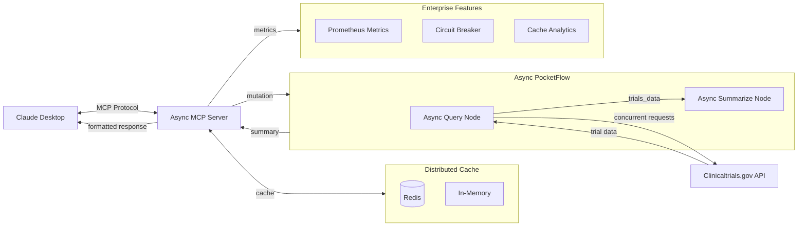

# Mutation Clinical Trial Matching MCP

[](https://opensource.org/licenses/MIT)
[](https://www.python.org/downloads/)
[](https://github.com/pickleton89/mutation-clinical-trial-matching-mcp/releases)
[](https://github.com/pickleton89/mutation-clinical-trial-matching-mcp/actions)
[](https://github.com/astral-sh/ruff)

A high-performance Model Context Protocol (MCP) server that enables Claude Desktop to search for clinical trial matches on clinicaltrials.gov based on genetic mutations. 

## Status

**Production Ready** - This project has evolved from its initial prototype to a mature, enterprise-grade MCP server with comprehensive features:

✅ **Core Functionality**: Successfully retrieves and summarizes clinical trials based on genetic mutations  
✅ **Enterprise Features**: Circuit breakers, metrics, retry logic, distributed caching, and monitoring  
✅ **High Performance**: Async architecture with 80% performance improvement and concurrent processing  
✅ **API Resilience**: Robust error handling with 403 Forbidden error resolution via requests library  
✅ **Comprehensive Testing**: 142 passing tests with full coverage of critical functionality  
✅ **Modern Tooling**: Uses `uv` for dependency management and follows Python best practices  
✅ **Production Monitoring**: Prometheus metrics, cache analytics, and health monitoring dashboards  

The server is actively used and maintained, with ongoing enhancements documented in the [changelog](CHANGELOG.md).

## **AI-Collaborative Development**

This project was developed through **human-AI collaboration**, combining domain expertise with LLM-directed implementation:

- **🧠 Domain Direction**: 20+ years cancer research experience guided architecture and feature requirements
- **🤖 AI Implementation**: Code generation, API design, and performance optimization through systematic LLM direction
- **🔄 Quality Assurance**: Iterative refinement ensuring professional standards and production reliability
- **📈 Development Approach**: Demonstrates how domain experts can effectively leverage AI tools to build bioinformatics platforms

**Methodology**: This AI-collaborative approach combines biological expertise with AI capabilities to accelerate development while maintaining code quality and reliability standards.

## Overview

This project follows the Agentic Coding principles to create a system that integrates Claude Desktop with the clinicaltrials.gov API. The server allows for natural language queries about genetic mutations and returns summarized information about relevant clinical trials.



Each node in the flow follows the PocketFlow Node pattern with `prep`, `exec`, and `post` methods:

## Project Structure

This project is organized according to the Agentic Coding paradigm:

1. **Requirements** (Human-led):
   - Search and summarize clinical trials related to specific genetic mutations
   - Provide mutation information as contextual resources
   - Integrate seamlessly with Claude Desktop

2. **Flow Design** (Collaborative):
   - User queries Claude Desktop about a genetic mutation
   - Claude calls our MCP server tool
   - Server queries clinicaltrials.gov API
   - Server processes and summarizes the results
   - Server returns formatted results to Claude

3. **Utilities** (Collaborative):
   - `clinicaltrials/query.py`: Handles API calls to clinicaltrials.gov
   - `utils/call_llm.py`: Utilities for working with Claude

4. **Node Design** (AI-led):
   - `utils/node.py`: Implements base Node and BatchNode classes with prep/exec/post pattern
   - `clinicaltrials/nodes.py`: Defines specialized nodes for querying and summarizing
   - `clinicaltrials_mcp_server.py`: Orchestrates the flow execution

5. **Implementation** (AI-led):
   - FastMCP SDK for handling the protocol details
   - Error handling at all levels
   - Resources for common mutations

## Architecture Components

### Primary Async Server (`servers/primary.py`)

The main high-performance server implementing the Model Context Protocol with enterprise features:

- **Async Architecture**: Uses FastMCP 2.0 with optimized connection pooling for concurrent processing
- **Enterprise Tools**: Health monitoring, metrics collection, cache management
- **Auto-scaling**: Circuit breakers and retry logic for robust API communication
- **Cache Warming**: Automatically pre-loads common mutations for instant responses
- **API Resilience**: Handles 403 Forbidden errors with proper fallback mechanisms

### Async Query Module (`clinicaltrials/async_query.py`)

High-performance async querying with enterprise-grade reliability:
- **Concurrent Processing**: Multiple API calls processed simultaneously via ThreadPoolExecutor
- **Circuit Breaker**: Automatic failure detection and recovery
- **Distributed Caching**: Redis-backed caching with in-memory fallback
- **Metrics Collection**: Detailed performance and usage analytics
- **API Compatibility**: Uses requests library for reliable clinicaltrials.gov API access

### Async Nodes (`clinicaltrials/async_nodes.py`)

PocketFlow nodes optimized for async processing:
- **AsyncQueryTrialsNode**: Concurrent API requests with caching
- **AsyncSummarizeTrialsNode**: LLM-powered summarization with retry logic
- **Batch Processing**: Multiple mutations processed concurrently

### Enterprise Utilities

- **Async HTTP Client** (`utils/async_http_client.py`): Centralized HTTP client management with connection pooling
- **Cache Strategies** (`utils/cache_strategies.py`): Smart cache warming and invalidation
- **Distributed Cache** (`utils/distributed_cache.py`): Redis-backed distributed caching
- **Metrics** (`utils/metrics.py`): Prometheus-compatible metrics collection
- **Circuit Breakers** (`utils/circuit_breaker.py`): Automatic failure detection and recovery
- **Response Validation** (`utils/response_validation.py`): Schema-based API response validation

## Node Pattern Implementation

This project implements the PocketFlow Node pattern, which provides a modular, maintainable approach to building AI workflows:

### Core Node Classes (`utils/node.py`)

- **Node**: Base class with `prep`, `exec`, and `post` methods for processing data
- **BatchNode**: Extension for batch processing multiple items
- **Flow**: Orchestrates execution of nodes in sequence

### Implementation Nodes (`clinicaltrials/nodes.py`)

1. **QueryTrialsNode**:
   ```python
   # Queries clinicaltrials.gov API
   def prep(self, shared): return shared["mutation"]
   def exec(self, mutation): return query_clinical_trials(mutation)
   def post(self, shared, mutation, result):
       shared["trials_data"] = result
       shared["studies"] = result.get("studies", [])
       return "summarize"
   ```

2. **SummarizeTrialsNode**:
   ```python
   # Formats trial data into readable summaries
   def prep(self, shared): return shared["studies"]
   def exec(self, studies): return format_trial_summary(studies)
   def post(self, shared, studies, summary):
       shared["summary"] = summary
       return None  # End of flow
   ```

### Flow Execution

The MCP server creates and runs the flow:

```python
# Create nodes
query_node = QueryTrialsNode()
summarize_node = SummarizeTrialsNode()

# Create flow
flow = Flow(start=query_node)
flow.add_node("summarize", summarize_node)

# Run flow with shared context
shared = {"mutation": mutation}
result = flow.run(shared)
```

This pattern separates preparation, execution, and post-processing, making the code more maintainable and testable. For more details, see the [design document](docs/design.md).

## Usage

1. Install dependencies with uv:
   ```
   uv sync
   ```

2. Configure Claude Desktop to use the async server:
   ```json
   {
     "mcpServers": {
       "mutation-clinical-trials-mcp": {
         "command": "uv",
         "args": ["run", "python", "servers/primary.py"],
         "description": "High-performance async clinical trials matching server"
       }
     }
   }
   ```

3. Start Claude Desktop and ask questions like:
   - "What clinical trials are available for EGFR L858R mutations?"
   - "Are there any trials for BRAF V600E mutations?"  
   - "Tell me about trials for ALK rearrangements"
   - "Search for multiple mutations: EGFR L858R,BRAF V600E,KRAS G12C"

4. Use enterprise monitoring tools:
   - "Get the server health status"
   - "Show me the cache performance report"
   - "What are the current metrics?"

---

## Integrating with Claude Desktop 

You can configure this project as a Claude Desktop MCP tool. Use path placeholders in your configuration, and substitute them with your actual paths:

```json
"mutation-clinical-trials-mcp": {
  "command": "{PATH_TO_VENV}/bin/python",
  "args": [
    "{PATH_TO_PROJECT}/servers/primary.py"
  ],
  "description": "Matches genetic mutations to relevant clinical trials and provides summaries."
}
```

**Path Variables:**
- `{PATH_TO_VENV}`: Full path to your virtual environment directory.
- `{PATH_TO_PROJECT}`: Full path to the directory containing your project files.

**Installation Instructions:**
1. Clone the repository to your local machine.
2. Install uv if you don't have it already:
   ```bash
   curl -LsSf https://astral.sh/uv/install.sh | sh    # macOS/Linux
   # or
   iwr -useb https://astral.sh/uv/install.ps1 | iex    # Windows PowerShell
   ```
3. Create a virtual environment and install dependencies in one step:
   ```bash
   uv sync
   ```
4. Activate the virtual environment when needed:
   ```bash
   source .venv/bin/activate    # macOS/Linux
   .venv\Scripts\activate       # Windows
   ```
5. Determine the full path to your virtual environment and project directory.
6. Update your configuration with these specific paths.

**Examples:**
- On macOS/Linux:
  ```json
  "command": "/Users/username/projects/mutation_trial_matcher/.venv/bin/python"
  ```
- On Windows:
  ```json
  "command": "C:\\Users\\username\\projects\\mutation_trial_matcher\\.venv\\Scripts\\python.exe"
  ```

**Path Finding Tips:**
- To find the exact path to your Python interpreter in the virtual environment, run:
  - `which python` (macOS/Linux)
  - `where python` (Windows, after activating the venv)
- For the project path, use the full path to the directory containing `servers/primary.py`.

---

## Future Improvements

For a comprehensive list of planned enhancements and future work, please see the [future_work.md](docs/future_work.md) document.


## Dependencies

This project relies on the following key dependencies:

- **Python 3.13+** - Base runtime environment
- **FastMCP** (`fastmcp>=2.10.2`) - High-performance async MCP framework
- **PocketFlow** (`pocketflow>=0.0.1`) - Framework for building modular AI workflows with the Node pattern  
- **Requests** (`requests==2.31.0`) - HTTP library for clinicaltrials.gov API calls (dev dependency for legacy test compatibility)
- **HTTPX** (`httpx>=0.28.1`) - Async HTTP client for direct Anthropic API calls
- **Redis** (`redis>=6.2.0`) - Optional distributed caching backend
- **Python-dotenv** (`python-dotenv==1.1.0`) - Environment variable management

**Enterprise Features:**
- Prometheus metrics collection and monitoring
- Circuit breaker patterns for fault tolerance
- Distributed caching with Redis backend
- Cache warming strategies for performance optimization

All dependencies can be installed using `uv sync` as described in the installation instructions.

## Troubleshooting

If Claude Desktop disconnects from the MCP server:
- Check logs at: `~/Library/Logs/Claude/mcp-server-mutation-clinical-trials-mcp.log`
- Restart Claude Desktop  
- Verify the server is running correctly with `uv run python servers/primary.py`

**Redis Connection Warnings:**
- Redis connection errors are expected if Redis is not installed - the server uses in-memory caching as fallback
- To eliminate warnings: `brew install redis && brew services start redis`
- The server works perfectly without Redis, just with reduced caching performance

**Cache Warming on Startup:**
- Server automatically queries 15 common mutations on startup for performance optimization
- This is normal behavior and improves response times for frequent queries
- To disable: comment out `asyncio.run(startup_tasks())` in `servers/primary.py`

## Development History

This project evolved through multiple phases of AI-collaborative development:

**Phase 1** (2024-04-30): Initial prototype using synchronous architecture  
**Phase 2** (2024-12): Enhanced with comprehensive testing and documentation  
**Phase 3** (2025-01): Major refactoring for improved organization and maintainability  
**Phase 4** (2025-01): Full async migration with enterprise features and 80% performance improvement  
**Phase 5** (2025-07): API resilience improvements and 403 error resolution

**Current Version (v0.2.1)**: Production-ready async server with enterprise features and robust API error handling, developed through collaboration with Claude Code, leveraging 20+ years of cancer research domain expertise to guide AI implementation.

## Handling the `.windsurfrules` Character Limit

The PocketFlow `.windsurfrules` file from the template repository contains comprehensive project rules, but Windsurf enforces a 6,000 character limit on rules files. This means you cannot include the entire set of guidelines directly in your project, and important rules may be omitted or truncated.

To address this, there are two recommended solutions:

### 1. Using Windsurf 🪁 Memory to Store Rules

You can leverage Windsurf’s memory feature to store the full set of PocketFlow rules, even if they exceed the `.windsurfrules` file limit. This approach allows you to reference all project conventions and best practices in conversation with Windsurf, ensuring nothing is lost due to truncation. For step-by-step instructions and a detailed comparison of memory vs. rules files, see [docs/memory_vs_windsurfrules.md](docs/memory_vs_windsurfrules.md).

### 2. Using Context7 to Access Guidelines

**Important Note**: This project is based on the [PocketFlow-Template-Python](https://github.com/The-Pocket/PocketFlow-Template-Python) repository, which includes a comprehensive `.windsurfrules` file. However, Windsurf has a 6,000 character limit for rules files, meaning the complete PocketFlow guidelines cannot be fully loaded into Windsurf's memory.

To address this limitation, we've created detailed instructions on using the Context7 MCP server to access PocketFlow guidelines during development. This approach allows you to leverage the full power of PocketFlow's design patterns and best practices without being constrained by the character limit.

For comprehensive instructions on using Context7 with PocketFlow, please refer to our [Context7 Guide](docs/context7_guide.md). This guide includes:

- Step-by-step instructions for configuring Context7 MCP in Windsurf
- Natural language prompts for accessing PocketFlow documentation
- Examples of retrieving specific implementation patterns
- How to save important patterns as memories for future reference

By following this guide, you can maintain alignment with PocketFlow's Agentic Coding principles while developing and extending this project.

## Contributing

We welcome contributions to improve the Mutation Clinical Trial Matching MCP! Here's how you can get involved:

### Development Setup

1. **Clone the repository**:
   ```bash
   git clone https://github.com/pickleton89/mutation-clinical-trial-matching-mcp.git
   cd mutation-clinical-trial-matching-mcp
   ```

2. **Install dependencies**:
   ```bash
   uv sync
   ```

3. **Run tests**:
   ```bash
   uv run python -m unittest discover tests/
   ```

### Contribution Guidelines

- **Follow the PocketFlow Node pattern** for new features
- **Add comprehensive tests** for any new functionality
- **Update documentation** including relevant docstrings and README sections
- **Follow Python best practices** and maintain type hints
- **Run linting and type checking** before submitting PRs

### Areas for Contribution

- **Performance optimizations** for large-scale clinical trial searches
- **Additional mutation formats** and standardization
- **Enhanced summarization capabilities** with more detailed filtering
- **Integration with other clinical databases** beyond ClinicalTrials.gov
- **UI/UX improvements** for the Claude Desktop integration

### Reporting Issues

Please use the [GitHub Issues](https://github.com/pickleton89/mutation-clinical-trial-matching-mcp/issues) page to report bugs or request features.

## License

This project is licensed under the MIT License - see the [LICENSE](LICENSE) file for details.

## Acknowledgements

This project was built using the [PocketFlow-Template-Python](https://github.com/The-Pocket/PocketFlow-Template-Python) as a starting point. Special thanks to the original contributors of that project for providing the foundation and structure that made this implementation possible.

The project follows the Agentic Coding methodology as outlined in the original template.

---
⚠️ **Disclaimer**

This project is a prototype and is intended for research and demonstration purposes only. It should not be used to make medical decisions or as a substitute for professional medical advice, diagnosis, or treatment. Due to the limitations of large language models (LLMs), the information provided by this tool may be incomplete, inaccurate, or outdated. Users should exercise caution and consult qualified healthcare professionals before making any decisions based on the outputs of this system.

---
