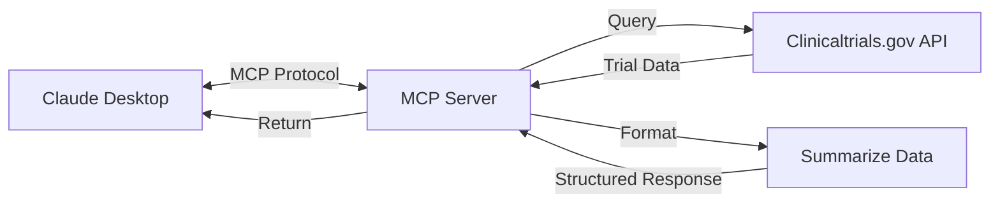

# Mutation Clinical Trial Matching MCP

A Model Context Protocol (MCP) server that enables Claude Desktop to search for and summarize clinical trials related to genetic mutations.

## Overview

This project follows the Agentic Coding principles to create a system that integrates Claude Desktop with the clinicaltrials.gov API. The server allows for natural language queries about genetic mutations and returns summarized information about relevant clinical trials.



## Project Structure

This project is organized according to the Agentic Coding paradigm:

1. **Requirements** (Human-led):
   - Search and summarize clinical trials related to specific genetic mutations
   - Provide mutation information as contextual resources
   - Integrate seamlessly with Claude Desktop

2. **Flow Design** (Collaborative):
   - User queries Claude Desktop about a genetic mutation
   - Claude calls our MCP server tool
   - Server queries clinicaltrials.gov API
   - Server processes and summarizes the results
   - Server returns formatted results to Claude

3. **Utilities** (Collaborative):
   - `clinicaltrials/query.py`: Handles API calls to clinicaltrials.gov
   - `utils/call_llm.py`: Utilities for working with Claude

4. **Node Design** (AI-led):
   - `llm/summarize.py`: Formats clinical trial data into readable summaries
   - `clinicaltrials_mcp_server.py`: Implements the MCP server interface

5. **Implementation** (AI-led):
   - FastMCP SDK for handling the protocol details
   - Error handling at all levels
   - Resources for common mutations

## Components

### MCP Server (`clinicaltrials_mcp_server.py`)

The main server that implements the Model Context Protocol interface, using the official Python SDK. It:

- Registers and exposes tools for Claude to use
- Provides resources with information about common mutations
- Handles the communication with Claude Desktop

### Query Module (`clinicaltrials/query.py`)

Responsible for querying the clinicaltrials.gov API with:
- Robust error handling
- Input validation
- Detailed logging

### Summarizer (`llm/summarize.py`) 

Processes and formats the clinical trials data:
- Organizes trials by phase
- Extracts key information (NCT ID, summary, conditions, etc.)
- Creates a readable markdown summary

## Usage

1. Install dependencies:
   ```
   uv pip install -r requirements.txt
   ```

2. Configure Claude Desktop:
   - The config at `/Users/jeffkiefer/Library/Application Support/Claude/claude_desktop_config.json` should already be set up

3. Start Claude Desktop and ask questions like:
   - "What clinical trials are available for EGFR L858R mutations?"
   - "Are there any trials for BRAF V600E mutations?"
   - "Tell me about trials for ALK rearrangements"

4. Use resources by asking:
   - "Can you tell me more about the KRAS G12C mutation?"

## Future Improvements

1. Add additional tools for:
   - Filtering trials by location, phase, or status
   - Getting detailed information about a specific trial by NCT ID

2. Expand resources with:
   - More mutation types
   - Treatment options for each mutation type
   - Survival statistics

3. Improve summarization with:
   - Categorization by intervention type
   - Highlighting novel treatment approaches

## Dependencies

- Python 3.7+
- mcp[cli] - Official Model Context Protocol SDK
- requests - For API calls
- python-dotenv - For environment variable management

## Troubleshooting

If Claude Desktop disconnects from the MCP server:
- Check logs at: `/Users/jeffkiefer/Library/Logs/Claude/mcp-server-clinicaltrials-mcp.log`
- Restart Claude Desktop
- Verify the server is running correctly

## Acknowledgements

This project was built using the [PocketFlow-Template-Python](https://github.com/The-Pocket/PocketFlow-Template-Python) as a starting point. Special thanks to the original contributors of that project for providing the foundation and structure that made this implementation possible.

The project follows the Agentic Coding methodology as outlined in the original template.
