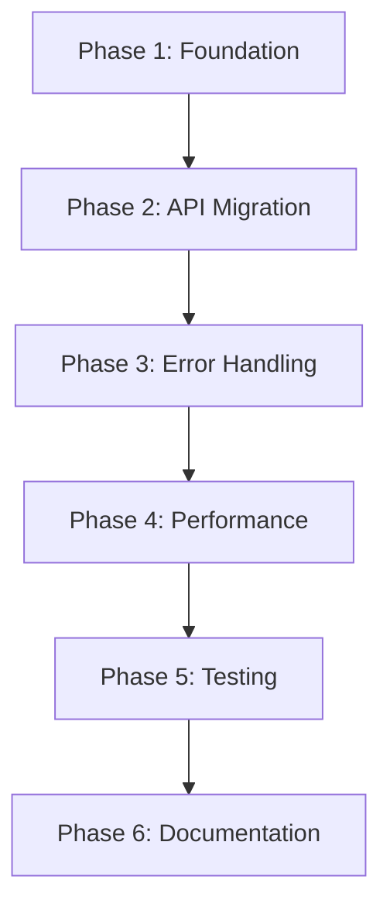

# Async Migration Plan: Aligning with PocketFlow Design Principles

## Executive Summary

This document outlines the migration plan to align our clinical trials MCP server with PocketFlow's async design principles. The current architecture mixes synchronous `requests` (with ThreadPoolExecutor) and asynchronous `httpx`, which conflicts with PocketFlow's pure async I/O philosophy.

## Current State Analysis

### ❌ Anti-Patterns Identified

1. **Mixed HTTP Clients**:
   - `clinicaltrials/async_query.py`: Uses `requests` + `ThreadPoolExecutor`
   - `utils/async_call_llm.py`: Uses `httpx.AsyncClient`

2. **Threading in Async Context**:
   ```python
   # clinicaltrials/async_query.py:198-203
   result = await asyncio.get_event_loop().run_in_executor(
       executor, 
       _sync_query_clinical_trials_impl,  # Sync requests call
       mutation, min_rank, max_rank, timeout
   )
   ```

3. **Resource Contention**:
   - ThreadPoolExecutor competes with async event loop
   - Inconsistent timeout handling between sync/async patterns
   - Potential blocking on DNS/SSL in thread pool

### ✅ Current Strengths

1. **Good Error Handling**: Comprehensive retry logic and circuit breakers
2. **Metrics Collection**: Detailed performance monitoring
3. **PocketFlow Node Pattern**: Proper `prep_async()`, `exec_async()`, `post_async()` structure
4. **Configuration Management**: Centralized config system

## Target State: Pure Async Architecture

### 🎯 Design Principles (PocketFlow Aligned)

1. **Pure Async I/O**: All HTTP operations use `httpx.AsyncClient`
2. **I/O Overlap**: Maximize concurrent I/O without threading
3. **Consistent Patterns**: Unified async patterns across all APIs
4. **Resource Efficiency**: Single event loop, shared connection pooling

### Architecture Overview

```
┌─────────────────────────────────────────────────────────┐
│                   AsyncFlow                             │
│  ┌─────────────────┐    ┌──────────────────────────┐   │
│  │ QueryTrialsNode │───▶│ SummarizeTrialsNode      │   │
│  │                 │    │                          │   │
│  │ httpx.AsyncClient    │ httpx.AsyncClient        │   │
│  │ (Clinical Trials)    │ (Anthropic API)         │   │
│  └─────────────────┘    └──────────────────────────┘   │
└─────────────────────────────────────────────────────────┘
```

## Migration Implementation Plan

### Phase 1: Foundation Setup
**Duration**: 1-2 days

#### 1.1 Create Unified HTTP Client Manager
- **File**: `utils/async_http_client.py`
- **Purpose**: Centralized async HTTP client management
- **Features**:
  - Shared connection pooling
  - Unified timeout configuration
  - Proper resource cleanup
  - Per-service client instances

#### 1.2 Update Dependencies
- **Action**: Verify `httpx` version compatibility
- **Remove**: `requests` dependency (keep for tests if needed)
- **Update**: `pyproject.toml` to reflect changes

### Phase 2: Clinical Trials API Migration
**Duration**: 2-3 days

#### 2.1 Migrate async_query.py
- **Current**: `requests` + `ThreadPoolExecutor`
- **Target**: Pure `httpx.AsyncClient`
- **Key Changes**:
  ```python
  # OLD (anti-pattern)
  result = await asyncio.get_event_loop().run_in_executor(
      executor, _sync_query_clinical_trials_impl, ...
  )
  
  # NEW (PocketFlow aligned)
  async with httpx.AsyncClient() as client:
      response = await client.get(url, params=params, timeout=timeout)
      return response.json()
  ```

#### 2.2 Update Node Implementation
- **File**: `clinicaltrials/nodes.py`
- **Changes**: Ensure `QueryTrialsNode.exec_async()` uses pure async
- **Verify**: PocketFlow node pattern compliance

#### 2.3 Remove ThreadPoolExecutor
- **Remove**: `get_executor()`, `close_executor()` functions
- **Clean**: Global executor management code

### Phase 3: Error Handling & Resilience
**Duration**: 1-2 days

#### 3.1 Async Error Handling
- **Migrate**: Retry decorators to work with pure async
- **Update**: Circuit breaker patterns for `httpx`
- **Ensure**: Exception handling covers `httpx.RequestError`, `httpx.HTTPStatusError`

#### 3.2 Timeout Configuration
- **Unified**: Use `httpx.Timeout` for all HTTP operations
- **Configure**: Connect, read, write, pool timeouts consistently
- **Test**: Timeout behavior under various network conditions

### Phase 4: Performance Optimization
**Duration**: 1-2 days

#### 4.1 Connection Pooling
- **Implement**: Shared `httpx.AsyncClient` instances
- **Configure**: `max_connections`, `max_keepalive_connections`
- **Optimize**: Connection reuse across requests

#### 4.2 Concurrent Request Management
- **Use**: `asyncio.Semaphore` for rate limiting (not ThreadPoolExecutor)
- **Implement**: Pure async batch processing
- **Example**:
  ```python
  async def query_multiple_mutations_async(mutations: List[str]):
      semaphore = asyncio.Semaphore(max_concurrent)
      async def _query_with_semaphore(mutation):
          async with semaphore:
              return await query_clinical_trials_async(mutation)
      
      tasks = [_query_with_semaphore(m) for m in mutations]
      return await asyncio.gather(*tasks)
  ```

### Phase 5: Testing & Validation
**Duration**: 2-3 days

#### 5.1 Unit Tests
- **Update**: Test cases for pure async patterns
- **Mock**: `httpx.AsyncClient` responses
- **Test**: Error conditions, timeouts, retries

#### 5.2 Integration Tests
- **Verify**: End-to-end flow functionality
- **Test**: Concurrent request handling
- **Validate**: Performance improvements

#### 5.3 Performance Benchmarking
- **Measure**: Request latency improvements
- **Compare**: Memory usage (threads vs async)
- **Document**: Performance gains

### Phase 6: Documentation & Deployment
**Duration**: 1 day

#### 6.1 Update Documentation
- **CLAUDE.md**: Update architecture descriptions
- **README.md**: Reflect async-first approach
- **Code Comments**: Document async patterns

#### 6.2 Configuration Migration
- **Remove**: Thread pool configurations
- **Add**: HTTP client pool configurations
- **Update**: Default timeouts for async operations

## Implementation Order



## Risk Assessment

### High Risk
- **Breaking Changes**: Existing integrations may need updates
- **Performance Regression**: Initial implementation may have bugs

### Medium Risk
- **Configuration Drift**: Need to update all timeout/retry settings
- **Test Coverage**: Async testing patterns may need refinement

### Low Risk
- **Dependency Issues**: `httpx` is well-established
- **PocketFlow Compatibility**: Following documented patterns

## Success Criteria

### Functional
- [ ] All clinical trials API calls use `httpx.AsyncClient`
- [ ] No ThreadPoolExecutor usage in async context
- [ ] All tests pass with new async implementation
- [ ] Error handling and retries work correctly

### Performance
- [ ] Reduced memory usage (no thread overhead)
- [ ] Improved concurrent request handling
- [ ] Faster response times under load
- [ ] Better resource utilization

### Code Quality
- [ ] Consistent async patterns throughout codebase
- [ ] PocketFlow design principles compliance
- [ ] Clean separation of concerns
- [ ] Proper resource management (connection cleanup)

## Rollback Plan

If issues arise during migration:

1. **Git Revert**: Return to previous commit with `requests` + threading
2. **Feature Flag**: Implement toggle between old/new implementations
3. **Gradual Migration**: Migrate one API endpoint at a time
4. **Monitoring**: Set up alerts for performance degradation

## Next Steps

1. **Review & Approval**: Get stakeholder sign-off on this plan
2. **Environment Setup**: Prepare development/testing environments
3. **Phase 1 Implementation**: Begin with foundation setup
4. **Continuous Integration**: Ensure tests pass at each phase
5. **Performance Monitoring**: Track metrics throughout migration

---

*This document serves as the blueprint for migrating to PocketFlow-aligned async design principles. Each phase should be completed and validated before proceeding to the next.*