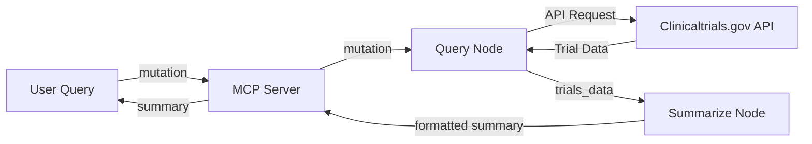
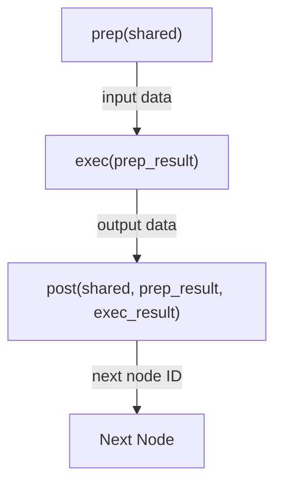
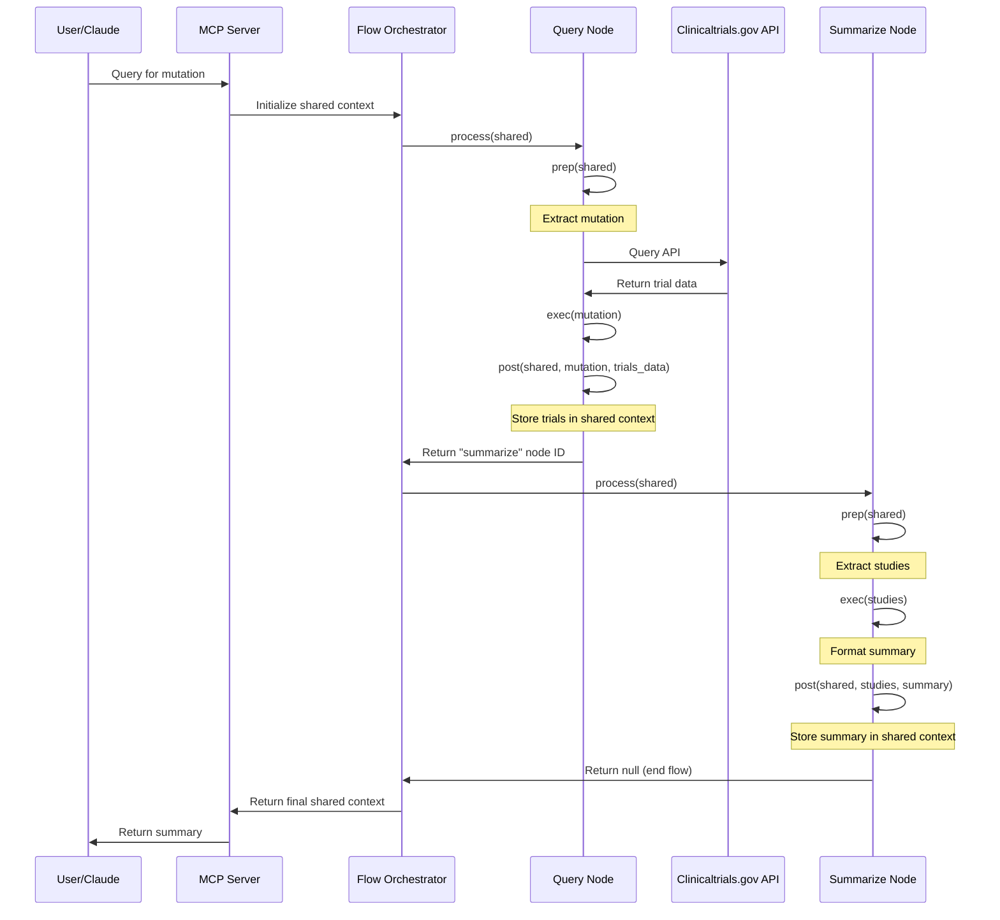

# Design Doc: Mutation Clinical Trial Matching MCP

## Requirements

The Mutation Clinical Trial Matching MCP is designed to enable Claude Desktop to search for clinical trials related to specific genetic mutations. The key requirements are:

1. **Search Capability**: Allow users to query for clinical trials based on specific genetic mutations (e.g., "BRAF V600E", "EGFR L858R").
2. **Data Retrieval**: Query the clinicaltrials.gov API to fetch relevant clinical trial data.
3. **Summarization**: Process and format the clinical trial data into readable, structured summaries.
4. **MCP Integration**: Implement the Model Context Protocol to enable seamless integration with Claude Desktop.
5. **Modular Design**: Follow the PocketFlow Node pattern for improved maintainability and extensibility.

## Flow Design

### Applicable Design Patterns

1. **Agent Pattern**: The MCP server acts as an agent that receives queries, performs actions (API calls), and returns processed results.
2. **Workflow Pattern**: The system follows a sequential workflow from query to retrieval to summarization.

### Flow High-level Design

1. **Query Node**: Receives a mutation query and fetches clinical trial data from clinicaltrials.gov API.
2. **Summarize Node**: Processes the retrieved clinical trial data and formats it into a readable summary.



### Node Pattern Implementation

The implementation follows the PocketFlow Node pattern with each node having three key methods:



#### Flow Execution Process


## Utility Functions

The project uses the following utility functions to support the node operations:

1. **Query Clinical Trials** (`clinicaltrials/query.py`)
   - *Input*: mutation (str), min_rank (int), max_rank (int), timeout (int)
   - *Output*: Dictionary containing API response with clinical trial data
   - *Purpose*: Makes HTTP requests to the clinicaltrials.gov API to fetch trial data related to a specific mutation
   - *Used by*: QueryTrialsNode

2. **Call LLM** (`utils/call_llm.py`)
   - *Input*: prompt (str)
   - *Output*: response (str) from Claude API
   - *Purpose*: Sends prompts to Claude via Anthropic API for processing
   - *Used by*: SummarizeTrialsNode (indirectly through summarize_trials)

3. **Summarize Trials** (`llm/summarize.py`)
   - *Input*: List of clinical trial dictionaries
   - *Output*: Formatted markdown summary (str)
   - *Purpose*: Processes and formats clinical trial data into readable summaries
   - *Used by*: SummarizeTrialsNode

## Node Design

### Shared Memory

The shared memory structure used between nodes is organized as follows:

```python
shared = {
    "mutation": "BRAF V600E",              # Input mutation string
    "trials_data": {...},                 # Raw API response from clinicaltrials.gov
    "studies": [{...}, {...}, ...],      # List of study dictionaries extracted from trials_data
    "summary": "# Clinical Trials..."     # Final formatted summary in markdown
}
```

### Node Implementations

#### 1. QueryTrialsNode

- **Purpose**: Queries the clinicaltrials.gov API for trials related to a specific mutation
- **Type**: Regular Node
- **Implementation**:
  ```python
  class QueryTrialsNode(Node[str, Dict[str, Any]]):
      def prep(self, shared):
          # Extract mutation from shared context
          return shared["mutation"]
          
      def exec(self, mutation):
          # Query the API
          return query_clinical_trials(mutation)
          
      def post(self, shared, mutation, result):
          # Store results in shared context
          shared["trials_data"] = result
          shared["studies"] = result.get("studies", [])
          return "summarize"  # Next node ID
  ```

#### 2. SummarizeTrialsNode

- **Purpose**: Formats clinical trial data into a readable summary
- **Type**: Regular Node
- **Implementation**:
  ```python
  class SummarizeTrialsNode(Node[List[Dict[str, Any]], str]):
      def prep(self, shared):
          # Extract studies from shared context
          return shared["studies"]
          
      def exec(self, studies):
          # Generate summary
          return format_trial_summary(studies)
          
      def post(self, shared, studies, summary):
          # Store summary in shared context
          shared["summary"] = summary
          return None  # End of flow
  ```

### Flow Orchestration

The Flow class orchestrates the execution of nodes:

```python
def summarize_trials(mutation: str) -> str:
    # Create nodes
    query_node = QueryTrialsNode()
    summarize_node = SummarizeTrialsNode()
    
    # Create flow
    flow = Flow(start=query_node)
    flow.add_node("summarize", summarize_node)
    
    # Run flow with shared context
    shared = {"mutation": mutation}
    result = flow.run(shared)
    
    return result["summary"]
```

## Future Extensions

The Node pattern implementation allows for easy extension of the system with additional nodes:

1. **FilterTrialsNode**: Could be added between QueryTrialsNode and SummarizeTrialsNode to filter trials based on criteria like location, phase, or status.

2. **EnrichTrialsNode**: Could be added to enrich trial data with additional information from other sources.

3. **BatchQueryNode**: A BatchNode implementation could be created to handle multiple mutations in a single request.


