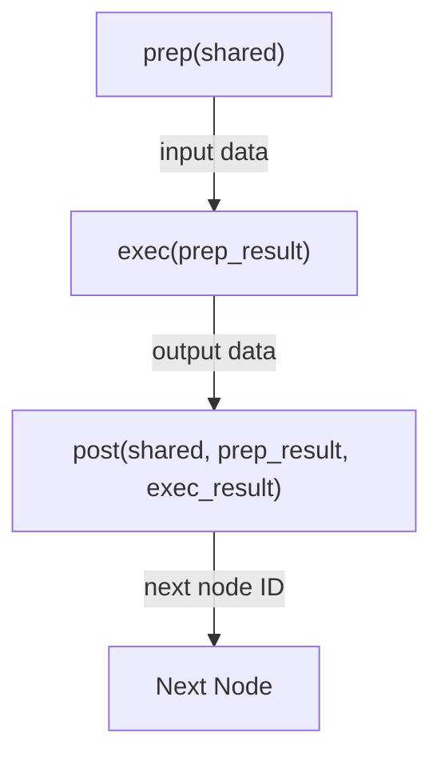
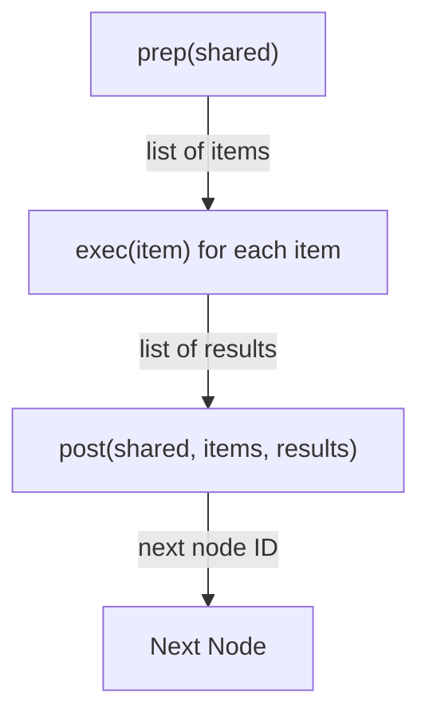
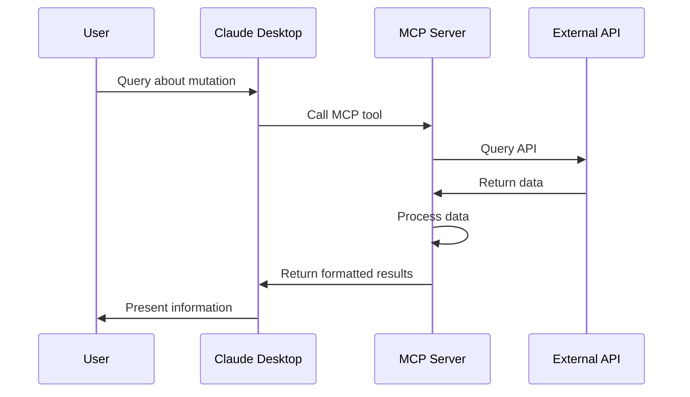

# Design Patterns: Mutation Clinical Trial Matching MCP

This document outlines the key design patterns used in the Mutation Clinical Trial Matching MCP project, following the Agentic Coding principles where humans design and agents code.

## PocketFlow Patterns

The project implements several core PocketFlow patterns:

### 1. Node Pattern

The Node pattern is the fundamental building block of the system, providing a consistent interface for data processing:



#### Implementation

```python
class Node(Generic[T_prep, T_exec]):
    def prep(self, shared: Dict[str, Any]) -> T_prep:
        """Extract and prepare data from the shared context."""
        pass
        
    def exec(self, prep_result: T_prep) -> T_exec:
        """Execute the node's core functionality."""
        pass
        
    def post(self, shared: Dict[str, Any], prep_result: T_prep, exec_result: T_exec) -> Optional[str]:
        """Process results and update the shared context."""
        pass
```

**Benefits:**
- Clear separation of concerns
- Improved testability
- Consistent interface
- Enhanced maintainability

### 2. Flow Pattern

The Flow pattern orchestrates the execution of nodes:

```mermaid
flowchart LR
    start[Start] --> nodeA[Node A]
    nodeA -->|"next_id"| nodeB[Node B]
    nodeB -->|"next_id"| nodeC[Node C]
    nodeC --> end[End]
```

#### Implementation

```python
class Flow:
    def __init__(self, start: Node):
        self.start = start
        self.nodes = {}
        
    def add_node(self, node_id: str, node: Node):
        self.nodes[node_id] = node
        
    def run(self, shared: Dict[str, Any]) -> Dict[str, Any]:
        current_node = self.start
        next_id = current_node.process(shared)
        
        while next_id:
            if next_id not in self.nodes:
                raise ValueError(f"Node ID '{next_id}' not found in flow")
            current_node = self.nodes[next_id]
            next_id = current_node.process(shared)
            
        return shared
```

**Benefits:**
- Decoupled node execution
- Flexible flow control
- Reusable components
- Simplified testing

### 3. BatchNode Pattern

The BatchNode pattern extends the Node pattern to handle batch processing:



#### Implementation

```python
class BatchNode(Node[List[T_item], List[T_result]]):
    def process(self, shared: Dict[str, Any]) -> Optional[str]:
        items = self.prep(shared)
        results = [self.exec(item) for item in items]
        return self.post(shared, items, results)
```

**Benefits:**
- Parallel processing capability
- Consistent interface with Node pattern
- Simplified batch operations

## Agent Pattern

The MCP server implements the Agent pattern, acting as an intelligent agent that:

1. Receives requests from Claude Desktop
2. Processes them using the PocketFlow
3. Returns formatted results



## RAG-like Pattern

While not a full Retrieval-Augmented Generation (RAG) implementation, the system follows a similar pattern:

1. **Retrieval**: Fetching relevant clinical trial data from clinicaltrials.gov
2. **Processing**: Filtering and organizing the retrieved data
3. **Generation**: Creating a structured summary of the information


## Workflow Pattern

The system implements a sequential workflow pattern:

```mermaid
flowchart LR
    start[Start] --> query[Query Trials]
    query --> filter[Filter Trials]
    filter --> summarize[Summarize Trials]
    summarize --> end[End]
```

This pattern allows for:
- Clear progression of data through the system
- Well-defined handoff points between stages
- Easy insertion of additional processing steps

## Applying Design Patterns

### When to Use Each Pattern

| Pattern | When to Use |
|---------|-------------|
| **Node** | For any discrete processing step with clear inputs and outputs |
| **Flow** | When orchestrating multiple processing steps |
| **BatchNode** | When processing multiple items in parallel |
| **Agent** | When interfacing with external systems or users |
| **RAG-like** | When retrieving, processing, and generating content |
| **Workflow** | When implementing a sequential process |

### Extending with New Patterns

The modular design allows for easy extension with additional patterns:

1. **Caching Pattern**: Add caching of API responses to improve performance
2. **Retry Pattern**: Implement automatic retries for failed API calls
3. **Observer Pattern**: Add monitoring and logging of the flow execution
4. **Strategy Pattern**: Allow for pluggable strategies for different aspects (e.g., different summarization approaches)

## Implementation Examples

### Node Pattern Example

```python
class QueryTrialsNode(Node[str, Dict[str, Any]]):
    def prep(self, shared):
        return shared["mutation"]
        
    def exec(self, mutation):
        return query_clinical_trials(mutation)
        
    def post(self, shared, mutation, result):
        shared["trials_data"] = result
        shared["studies"] = result.get("studies", [])
        return "summarize"
```

### Flow Pattern Example

```python
def create_flow():
    query_node = QueryTrialsNode()
    filter_node = FilterTrialsNode()
    summarize_node = SummarizeTrialsNode()
    
    flow = Flow(start=query_node)
    flow.add_node("filter", filter_node)
    flow.add_node("summarize", summarize_node)
    
    return flow
```

### BatchNode Pattern Example

```python
class BatchSummarizeNode(BatchNode[Dict[str, Any], str]):
    def prep(self, shared):
        return shared["studies"]
        
    def exec(self, study):
        return summarize_single_study(study)
        
    def post(self, shared, studies, summaries):
        shared["study_summaries"] = summaries
        shared["combined_summary"] = "\n\n".join(summaries)
        return None
```

## Best Practices

1. **Keep Nodes Focused**: Each node should have a single responsibility
2. **Use Shared Context Wisely**: Only store necessary data in the shared context
3. **Handle Errors Gracefully**: Implement robust error handling in each node
4. **Test Each Pattern**: Write tests for each pattern implementation
5. **Document Pattern Usage**: Clearly document how and why patterns are used

## Conclusion

The design patterns used in this project provide a solid foundation for a maintainable, extensible system. By following the Agentic Coding principles, the project leverages human design expertise with AI implementation capabilities to create a robust solution for matching genetic mutations to clinical trials.
