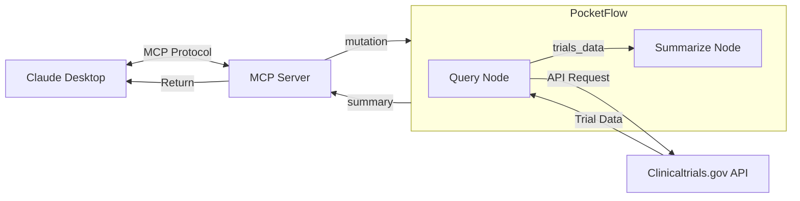

# Implementation Guide: Mutation Clinical Trial Matching MCP

This guide details the implementation approach following the Agentic Coding principles and PocketFlow patterns.

## 1. Requirements (Human-led)

The requirements for this project were defined by human understanding of the problem domain:

- Search for clinical trials related to specific genetic mutations
- Provide contextual information about mutations
- Integrate with Claude Desktop via MCP protocol
- Present information in a structured, readable format

## 2. Flow Design (Collaborative)

The flow design was created collaboratively, with humans specifying the high-level design and AI filling in the details:



### Node Interactions

1. User queries Claude Desktop about a genetic mutation
2. Claude calls our MCP server tool with the mutation parameter
3. MCP server initializes the PocketFlow with the mutation
4. QueryNode fetches data from clinicaltrials.gov API
5. SummarizeNode formats the data into a readable summary
6. MCP server returns the summary to Claude
7. Claude presents the information to the user

## 3. Utilities (Collaborative)

The utility functions were designed collaboratively, with humans specifying the interfaces and AI implementing the details:

### API Utilities (`clinicaltrials/query.py`)

```python
def query_clinical_trials(mutation, min_rank=1, max_rank=100, timeout=30):
    """
    Query the clinicaltrials.gov API for trials related to a mutation.
    
    Args:
        mutation (str): The genetic mutation to search for
        min_rank (int): Minimum rank for results
        max_rank (int): Maximum rank for results
        timeout (int): Request timeout in seconds
        
    Returns:
        dict: API response containing clinical trial data
    """
    # Implementation details...
```

### LLM Utilities (`utils/call_llm.py`)

```python
def call_llm(prompt, model="claude-3-opus-20240229"):
    """
    Call Claude API with a prompt.
    
    Args:
        prompt (str): The prompt to send to Claude
        model (str): The model to use
        
    Returns:
        str: Claude's response
    """
    # Implementation details...
```

### Summarization Utilities (`llm/summarize.py`)

```python
def format_trial_summary(studies):
    """
    Format clinical trial data into a readable summary.
    
    Args:
        studies (list): List of study dictionaries
        
    Returns:
        str: Markdown-formatted summary
    """
    # Implementation details...
```

## 4. Node Design (AI-led)

The node design was primarily AI-led, with the AI designing the data handling based on the flow:

### Base Node Classes (`utils/node.py`)

```python
class Node(Generic[T_prep, T_exec]):
    """Base node class with prep, exec, and post methods."""
    
    def prep(self, shared: Dict[str, Any]) -> T_prep:
        """Prepare data from shared context for execution."""
        raise NotImplementedError
        
    def exec(self, prep_result: T_prep) -> T_exec:
        """Execute the node's main functionality."""
        raise NotImplementedError
        
    def post(self, shared: Dict[str, Any], prep_result: T_prep, exec_result: T_exec) -> Optional[str]:
        """Process execution results and update shared context."""
        raise NotImplementedError
        
    def process(self, shared: Dict[str, Any]) -> Optional[str]:
        """Process the node by running prep, exec, and post in sequence."""
        prep_result = self.prep(shared)
        exec_result = self.exec(prep_result)
        return self.post(shared, prep_result, exec_result)
```

### Specialized Nodes (`clinicaltrials/nodes.py`)

```python
class QueryTrialsNode(Node[str, Dict[str, Any]]):
    """Node for querying clinicaltrials.gov API."""
    
    def prep(self, shared):
        return shared["mutation"]
        
    def exec(self, mutation):
        return query_clinical_trials(mutation)
        
    def post(self, shared, mutation, result):
        shared["trials_data"] = result
        shared["studies"] = result.get("studies", [])
        return "summarize"
```

```python
class SummarizeTrialsNode(Node[List[Dict[str, Any]], str]):
    """Node for summarizing clinical trial data."""
    
    def prep(self, shared):
        return shared["studies"]
        
    def exec(self, studies):
        return format_trial_summary(studies)
        
    def post(self, shared, studies, summary):
        shared["summary"] = summary
        return None  # End of flow
```

## 5. Implementation (AI-led)

The implementation was primarily AI-led, with the AI implementing the flow based on the design:

### Flow Orchestration (`clinicaltrials_mcp_server.py`)

```python
def handle_search_request(mutation):
    """Handle a search request from Claude Desktop."""
    
    # Create nodes
    query_node = QueryTrialsNode()
    summarize_node = SummarizeTrialsNode()
    
    # Create flow
    flow = Flow(start=query_node)
    flow.add_node("summarize", summarize_node)
    
    # Run flow with shared context
    shared = {"mutation": mutation}
    result = flow.run(shared)
    
    return result["summary"]
```

## 6. Optimization (Collaborative)

Optimization is a collaborative effort, with humans evaluating results and AI helping optimize:

### Performance Optimizations

- **Caching**: Implement caching of API responses to reduce redundant calls
- **Parallel Processing**: Use BatchNode for processing multiple items in parallel
- **Response Size**: Limit the number of trials returned to improve performance

### Quality Optimizations

- **Relevance Ranking**: Improve the relevance of returned trials
- **Summary Quality**: Enhance the summary format for better readability
- **Error Handling**: Implement robust error handling and recovery

## 7. Reliability (AI-led)

Reliability is primarily AI-led, with the AI writing test cases and addressing corner cases:

### Error Handling

```python
def query_clinical_trials(mutation, min_rank=1, max_rank=100, timeout=30):
    try:
        # API call implementation...
    except requests.Timeout:
        logger.error(f"Request timed out after {timeout} seconds")
        return {"error": "timeout", "studies": []}
    except requests.RequestException as e:
        logger.error(f"API request failed: {str(e)}")
        return {"error": "request_failed", "studies": []}
```

### Testing

```python
def test_query_node():
    """Test the QueryTrialsNode functionality."""
    node = QueryTrialsNode()
    shared = {"mutation": "BRAF V600E"}
    next_node = node.process(shared)
    
    assert next_node == "summarize"
    assert "trials_data" in shared
    assert "studies" in shared
```

## Best Practices

1. **Start Small**: Begin with a minimal implementation and expand incrementally
2. **Design First**: Always design the flow before implementation
3. **Test Early**: Write tests for each component as you develop
4. **Document Clearly**: Document the purpose and behavior of each component
5. **Error Handling**: Implement robust error handling at all levels
6. **User Feedback**: Regularly get feedback from users to improve the system

## Next Steps

1. Implement additional nodes for filtering and enriching trial data
2. Add support for batch processing of multiple mutations
3. Enhance error handling and recovery mechanisms
4. Implement caching to improve performance
5. Add more comprehensive testing
